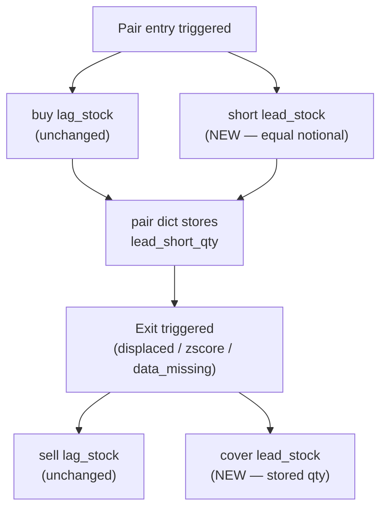

# Short Leg for Lead Symbol (H1 Fix)

## Context

Currently every pair entry is **long-only**: buy lag_stock, no offsetting position. This produces beta ~0.5–0.8 vs SPY and makes losses in bull/bear markets structural, not tunable. The fix is to simultaneously short the lead symbol in equal notional when entering a pair, making each position dollar-neutral.

## Architecture of the change



## Files to change

### 1. `schema.sql` — two additions

**`trades` table:** add a `leg` column to distinguish long vs short fills.

```sql
leg  VARCHAR(5)  DEFAULT 'long' CHECK (leg IN ('long', 'short'))
```

**`pairs` table:** add `lead_short_qty` so paper-trading restarts can restore the open short quantity without re-querying trades.

```sql
lead_short_qty  NUMERIC  -- NULL when enable_short_leg=False
```

### 2. Migration SQL (new file `migrations/003_short_leg.sql`)

PR #40 (merged) already occupies `migrations/002_coint_cache.sql` — this must be `003`.

```sql
ALTER TABLE trades ADD COLUMN IF NOT EXISTS leg VARCHAR(5) DEFAULT 'long'
    CHECK (leg IN ('long', 'short'));
ALTER TABLE pairs  ADD COLUMN IF NOT EXISTS lead_short_qty NUMERIC;
```

### 3. [`DatabaseClient.py`](../DatabaseClient.py)

- `log_trade`: add `leg: str = 'long'` parameter; include it in the INSERT.
- `save_pair` / `load_active_pairs`: add `lead_short_qty` alongside the `coint_pvalue` / `halflife_days` columns already added by PR #40. The SELECT in `load_active_pairs` now returns 16 columns (post-PR #40); `lead_short_qty` will be column 17.

### 4. [`BobsBrain.py`](../BobsBrain.py)

**`initialize`** — add one parameter:
```python
self.enable_short_leg = self.parameters.get('enable_short_leg', False)
```
Default `False` keeps every existing backtest unaffected.

**`on_trading_iteration` — buy block** (around lines 569–608):

After the existing `create_order(lag_stock, quantity, 'buy')` / `submit_order`, when `enable_short_leg=True`:
1. Get `lead_price = self.get_last_price(pair['lead_stock'])`.
2. Compute `lead_qty = round(per_stock_budget / lead_price, 6)`.
3. Submit `create_order(lead_stock, lead_qty, 'sell')` — Lumibot treats this as a short entry because no long position exists.
4. Store `pair['lead_short_qty'] = lead_qty`.
5. Call `_db.log_trade(..., symbol=lead_stock, side='sell', leg='short', ...)`.
6. Deduct an additional `per_stock_budget` from `available_cash` (treat short collateral conservatively).

**`on_trading_iteration` — sell block** (around lines 522–543):

After the existing lag sell, when `enable_short_leg=True` and `pair.get('lead_short_qty', 0) > 0`:
1. Submit `create_order(lead_stock, lead_short_qty, 'buy')` — closes the short.
2. Call `_db.log_trade(..., symbol=lead_stock, side='buy', leg='short', exit_reason=pair['exit_reason'], ...)`.

**Cash guard:** The `available_cash < per_stock_budget` check already gates entry. With the short leg, each entry costs `2 × per_stock_budget` in effective collateral, so change the guard to:
```python
effective_cost = per_stock_budget * (2 if self.enable_short_leg else 1)
if available_cash < effective_cost:
    continue
```

**Shared-lead-symbol risk:** Multiple concurrent pairs may share the same lead symbol. Each pair stores its own `lead_short_qty` independently. Cover orders use the stored quantity, not the broker's net position, so netting is handled correctly at the broker layer.

## What does NOT change

- Z-score signal, spread definition, `StockEvaluator` — unchanged. The entry/exit trigger still comes from the lag/lead spread. `compute_spread_scores()` added by PR #40 is also unaffected.
- Composite scoring (now 5-component: `corr_long`, `corr_short`, `z_depth`, `coint`, `halflife`), displacement, k-target logic — unchanged.
- `PairSimulator` — legacy single-leg simulator used for discovery scoring, not live trade execution; stays as-is.
- All existing runs have `enable_short_leg` absent from their settings → defaults to `False` → fully backward-compatible.
- `tuning/parameter_space.py` — no new tunable parameter needed at this stage; `enable_short_leg` is a design-mode flag, not an Optuna dimension.

## Validation

Run two backtests that exactly replicate the H5 validation runs, adding only `enable_short_leg=True`. This gives a clean before/after comparison on the same date windows, same settings, and same pre-warmed `stock_prices` data — no confounders.

### Run A — sideways (primary comparator)

| | Baseline (run `0ec7cc`) | With short leg (new run) |
|---|---|---|
| Window | 2022-02-01 → 2022-04-29 (62 trading days) | identical |
| Settings | H5 defaults (see below) | + `enable_short_leg=True` |
| Return | +1.59% vs SPY -4.29% | expect improvement |
| Beta | ~0.5 (estimated from Phase 3 pattern) | expect < 0.1 |

**Why this window first:** 62 trading days runs in ~30 min warm-cache. The sideways regime is where mean-reversion pairs work naturally — if the short leg adds beta protection without harming the spread-convergence P&L, this is where it shows most clearly.

### Run B — bull market (directional stress test)

| | Baseline (run `691011`) | With short leg (new run) |
|---|---|---|
| Window | 2023-04-03 → 2023-06-29 (61 trading days) | identical |
| Settings | H5 defaults (see below) | + `enable_short_leg=True` |
| Return | -7.77% vs SPY +7.51% | long-only loss should largely disappear |
| Beta | ~0.7 (estimated) | expect < 0.1 |

**Why this window:** The bull-market loss is almost entirely directional (the short leg should absorb it). If the loss persists after adding the short leg, it reveals a genuine pairs-trading loss rather than a hedging gap.

### H5 default settings (both runs inherit these)

```json
{
  "max_k": 20, "w_coint": 0.1786, "w_halflife": 0.1071, "w_corr_long": 0.2143,
  "w_corr_short": 0.3571, "w_z_depth": 0.1429, "max_halflife_days": 60,
  "entry_threshold": 2.0, "exit_threshold": 0.5, "zscore_window": 20,
  "max_daily_candidates": 200, "target_deployed_pct": 0.6
}
```

### What to measure (both runs)

- **Portfolio beta vs SPY**: target < 0.1. Compute from daily `portfolio_value` changes vs `spy_value` changes in `portfolio_snapshots`.
- **Total return and max drawdown**: direct comparison vs `0ec7cc` / `691011`.
- **Avg active pairs**: the 2× effective cash cost per entry means the same capital supports roughly half as many simultaneous pairs. `0ec7cc` averaged ~10–12 active pairs (within `max_k=20`); expect ~5–6 with short leg. If the drop starves the book entirely, consider raising `max_k` or `target_deployed_pct` as a follow-up.
- **Displacement rate**: Phase 4 H5 data shows 35–50% displacement. Report whether this changes — a lower displacement rate is expected since dollar-neutral positions should hold their composite scores more stably through market moves.
- **Avg P&L per round-trip**: both legs must be included. A "round-trip" is now: `(sell_lag_price - buy_lag_price) * lag_qty + (cover_lead_price - short_lead_price) * lead_qty - slippage`. Query from `trades` joining `leg='long'` and `leg='short'` fills by `pair_id`.

### Simulation gap — borrow costs not modelled

Lumibot does not charge short borrow fees. Post-hoc estimate: `borrow_rate × avg_short_notional × avg_hold_days / 252`, using 1–2% annualized as a conservative range. Report this alongside simulated P&L so the go/no-go decision is honest.
